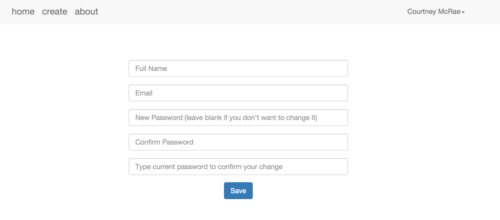

<h3>Bucket list</h3>
This website is created to motivate and inspire you to go out and actually achieve your goals, Buketlist allows you to create your own online bucket list and keep track of your life’s goals. Simply include whatever you still want to do, see or experience in your life and set deadlines for yourself.  

If you have achieved one of your goals, you can add a date, picture and description. It is then added to your list of completed bucket list items. This will help you create a set of memories of all the important milestones of your life, which you can look back on.  

If you fork this repo, you must run bundle install and rake db:migrate in order for the app to function properly.  

<h3>Technologies Used</h3>
Ruby 2.2.1  
Rails 4.2.5  
PostgreSQL Database  
Bootstrap-SASS ~> 3.3.4 (Gem)  
Paperclip (Gem)  
Jquery

<h3>User Stories</h3>
As a ..  I can..	         route  
User	learn about the site	( '/about' )            
User	create/edit/ my profile	  
User	create/edit/delete my bucket list  
User	create/edit/delete my photos		

User Model  
email, password, fullname_name

Buckerlist Model  
to_do, date, summary 

Photo Model  
photo 

<h3>Wireframes</h3>

